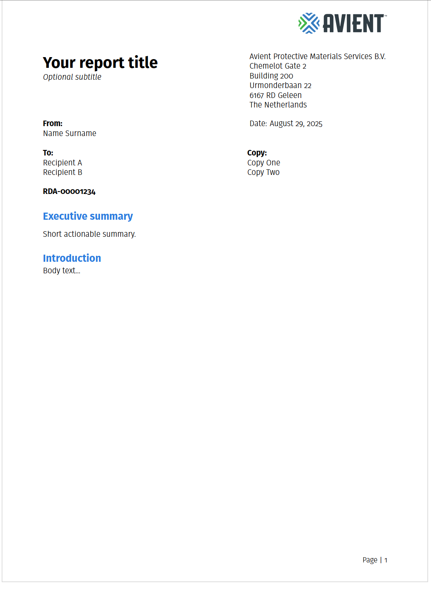

# avient.cls — Avient corporate LaTeX class

A lightweight LaTeX class for A4 reports in the **Avient Protective Materials** style.
It provides a branded title block, logo header, corporate colors, and a clean section style.

**Current version:** v0.7.4 (2025-08-29)  
**Maintainer:** Matthias Arras

---

## Example 



## Features

- A4 layout with tuned margins and header space
- Branded header (right-aligned logo; optional small *CONFIDENTIAL* tag)
- Two-column title row (Title/Subtitle left; Company Name/Address right)
- Meta blocks with stacking and sensible defaults:
  - **From:** (uses `\author{...}`)
  - *Reviewed by …* (optional; shown only if set)
  - **Date**
  - **To:** and **Copy:** (semicolon-separated entries stack on new lines)
  - **Document ID** emphasized block
- Corporate color palette and colored section headings
- Executive summary environment
- Font behavior:
  - Uses the **FiraSans** package (if installed) with **Light** as the default weight
  - XeLaTeX/LuaLaTeX fallback to system *Fira Sans Light* via `fontspec`
  - Final fallback to **Helvetica** (pdfLaTeX or if Fira is unavailable)

---

## Requirements

- LaTeX distribution: TeX Live / MacTeX / MiKTeX
- Engine: pdfLaTeX, **XeLaTeX**, or **LuaLaTeX**  
  (Fonts look best with Xe/Lua; pdfLaTeX uses Helvetica fallback)
- Optional font package: [`FiraSans`](https://ctan.org/pkg/fira)

Packages used by the class: `geometry`, `graphicx`, `array`, `tabularx`, `ragged2e`,
`titlesec`, `ifxetex`, `ifluatex`, `iftex`, `xcolor`, `xstring`, `fancyhdr`, `lastpage`,
`parskip`, `enumitem`, `hyperref`, `etoolbox`.

---

## Installation

### A) Project‑local (recommended for repos)

Put the class and assets **inside your project**:

```
your-project/
├─ avient.cls
├─ brand/
│  └─ avient-logo.pdf             % your company logo as PDF or PNG
└─ example.tex
```

Then in `example.tex`:

```tex
\documentclass[apm-report]{avient}
\setcompanylogo{brand/avient-logo.pdf}
...
```

### B) Manual install to your TEXMF tree

Install once so any document can `\documentclass{avient}`.

1. Find your TEXMFHOME:
   ```bash
   kpsewhich -var-value TEXMFHOME
   ```
2. Create directories and copy files:
   ```
   TEXMFHOME/
   └─ tex/latex/avient/
      ├─ avient.cls
      └─ brand/avient-logo.pdf
   ```
3. Refresh the file-name database:
   - TeX Live/MacTeX: `mktexlsr` (or `texhash`)
   - MiKTeX: MiKTeX Console → Tasks → **Refresh FNDB**
4. Use in any document:
   ```tex
   \documentclass[apm-report]{avient}
   \setcompanylogo{brand/avient-logo.pdf}
   ```

### C) Overleaf

Upload `avient.cls` and `brand/avient-logo.pdf` into your project root:

```tex
\documentclass[apm-report]{avient}
\setcompanylogo{brand/avient-logo.pdf}
```

---

## Fonts

The class prefers **Fira Sans Light** for the main text.

- If the `FiraSans` package is installed, the class loads:
  ```tex
  \RequirePackage[sfdefault,light]{FiraSans}
  ```
  You may add package options like `semibold`, `lining`, or `tabular` by editing the class if needed.
- If not available, **XeLaTeX/LuaLaTeX** try the system font “Fira Sans Light” via `fontspec`.
- If that fails (or on pdfLaTeX), the class falls back to **Helvetica**.

### Installing the FiraSans package

- TeX Live/MacTeX: `tlmgr install fira`  
- MiKTeX: install on-the-fly or via MiKTeX Console (search **fira**).

### Shipping your own fonts (optional)

If you want to bundle TTF/OTF files with a project, you can override in your **document preamble** (Xe/Lua only):

```tex
\usepackage{fontspec}
\setmainfont{FiraSans}[Path=./fonts/, Extension=.ttf,
  UprightFont=*-Light, ItalicFont=*-LightItalic,
  BoldFont=*-Bold,  BoldItalicFont=*-BoldItalic]
\setsansfont{FiraSans}[Path=./fonts/, Extension=.ttf,
  UprightFont=*-Light, ItalicFont=*-LightItalic,
  BoldFont=*-Bold,  BoldItalicFont=*-BoldItalic]
```

> Note: a `.cls` cannot “install” fonts on your OS; it only loads them for the document and embeds them in the PDF.

---

## Usage

### Minimal example

```tex
\documentclass[apm-report]{avient}
\setcompanylogo{brand/avient-logo.pdf}

\title{Multi-line report title goes here}
\subtitle{Optional subtitle line}
\author{Name Surname}                   % appears under “From:”
\setreviewer{Reviewer Name}             % optional; italic “Reviewed by …”
\date{September 2, 2025}
\setto{Recipient A; Recipient B}        % semicolon stacks entries
\setcc{Copy Person 1; Copy Person 2}
\setdocid{RDA-0000000X}
\setconfidential{CONFIDENTIAL}          % optional small tag in header

\begin{document}
\maketitle

\begin{executivesummary}
One-paragraph abstract / key actions, etc.
\end{executivesummary}

\section{Introduction}
Body text...
\end{document}
```

### Stacking lists with semicolons

The class turns semicolons into line breaks for names/recipients:

```tex
\setto{Alice Example; Bob Example; Carol Example}
\setcc{Stakeholder X; Stakeholder Y}
\author{Lead Author; Coauthor A; Coauthor B}
```

---

## Public API (commands)

### Identity & branding
- `\setcompanylogo{<path>}` — **PDF or PNG**. Shown in the header (right).
- `\setcompanyname{<text>}`
- `\setcompanyaddress{<text with \\ line breaks>}`
- `\setconfidential{<SMALL TAG>}` — optional; printed above the logo.

### Title block
- `\title{<text>}` — required
- `\subtitle{<text>}` — optional (hidden if empty)
- `\date{<text>}` — defaults to `\today`

### People & metadata
- `\author{<names>}` — shown under **From:** (semicolon stacks)
- `\setreviewer{<name>}` — optional; italic “Reviewed by …” (hidden if empty)
- `\setto{<names; semicolon separated>}` — **To:**
- `\setcc{<names; semicolon separated>}` — **Copy:**
- `\setdocid{<id>}` — **Document ID**

### Colors
- `\setbrandmain{2A7DE1}` — hex (without `#`)
- `\setbrandlight{51D4FF}`
- `\setbranddark{003478}`

### Environments
- `executivesummary` — large, bold, branded heading “Executive summary”

### FancyHDR Control
- `\thispagestyle{plain}` — hide the avient-logo if needed on landscape pages 
---

## Class options

- `apm-report` — style variant (default). *(Already active; passing it is optional.)*

All **unknown options** are forwarded to the base `article` class. For example:

```tex
\documentclass[11pt,twoside]{avient}
\documentclass[apm-report,twocolumn]{avient}
```

> The class internally loads `article` with `[11pt,a4paper]`. Your size options override the default.

---

## Layout (v0.7.1 defaults)

- `geometry`: `a4paper, margin=20mm, headheight=24mm, top=5mm, headsep=5mm, includehead`
- Header: right-aligned logo (~13 mm high), optional **CONFIDENTIAL** (small), no head rule
- Footer (right): `Page | <number>`
- Section headings: `\Large`, bold, colored `brandmain`
- Title/meta layout:
  - Row 1: **Title / Subtitle** (left) and **Company Name / Address** (right)
  - Row 2/3: **From**, *Reviewed by …*, **Date**, **To**, **Copy**, **Document ID**
  - **To**/**Copy** entries stack (semicolon-separated)

---

## Building

Typical commands (from project root):

```bash
# LuaLaTeX (recommended)
lualatex example.tex

# XeLaTeX
xelatex example.tex

# pdfLaTeX (falls back to Helvetica)
pdflatex example.tex
```

Run twice if you want cross-references (e.g., total pages) to resolve.

---

## Troubleshooting

- **“Fira Sans not found; using Helvetica” warning**  
  Install the `FiraSans` package *or* compile with Xe/Lua and ensure the system font
  “Fira Sans Light” is available; otherwise, consider bundling the fonts and overriding
  in the document preamble (see *Fonts*).

- **Header height warning (`\headheight is too small`)**  
  The class reserves 24 mm. If you increase the logo height, bump `headheight` in
  `geometry` or reduce `\includegraphics[height=...]{...}`.

- **Logo path issues**  
  Paths are relative to the compile working directory (some IDEs build in `build/`).
  Use an adjusted path (e.g., `../brand/avient-logo.pdf`) or change your working directory.

- **Reviewer still shows when not set**  
  v0.7.1 uses `\ifdefempty{...}{...}{...}` so the “Reviewed by …” line is hidden if
  `\setreviewer{}` is omitted or empty. Ensure you’re using the shipped class and haven’t
  overridden that block elsewhere.

---

## Changelog (high‑level)
- **v0.7.4 (2025-08-29)**
  - pagestyle `plain` without avient-logo.pdf
  
- **v0.7.3 (2025-08-29)**
  - Sections are numbered by default
  - Executive Summary part of TOC

- **v0.7.2 (2025-08-29)**
  - Elevated subtitle to fontsize `\Large`
  - Set Confidential as default in example.tex

- **v0.7.1 (2025‑08‑28)**
  - Adopt `FiraSans` package by default (`sfdefault,light`)
  - Truly conditional *Reviewed by …*
  - Header sizing stable; footer prints `Page | N`
  - Refined title/meta layout and stacking

---

## License

- For internal use
- `FiraSans`, the fonts are under the **SIL Open Font License 1.1** (see the package docs).

---
